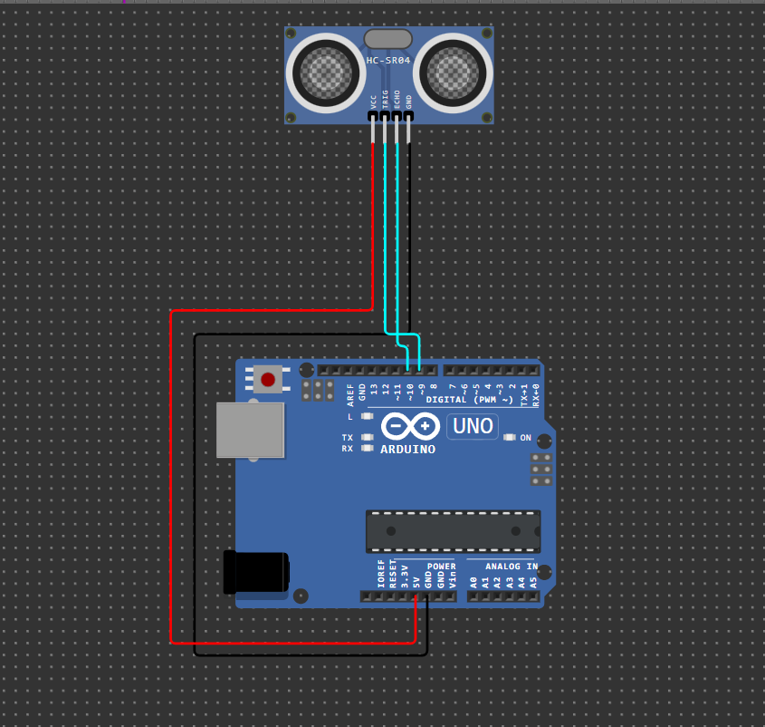

<h1 center="align">Sensor Jarak</h1>

Pengukur jarak dengan sensor ultrasonic HC-SR04 dan Arduino uno

<h3>Komponen yang Digunakan:</h3>

<ul>
<li>Arduino Uno</li>
<li>Sensor ultrasonic HC-SR04</li>
<li>Kabel jumper</li>
</ul>

<h3>Koneksi kabel</h3>

| HC-SR04 | Arduino Uno |
| ------- | ----------- |
| VCC     | 5V          |
| GND     | GND         |
| Trig    | Pin 9       |
| Echo    | Pin 10      |

<h3>Coba Demo</h3>

[🔌 Klik untuk Simulasi di Wokwi](https://wokwi.com/projects/418680848311396353)
